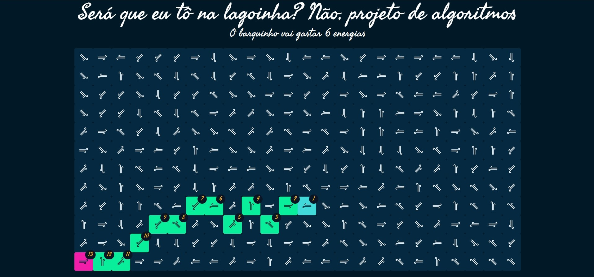
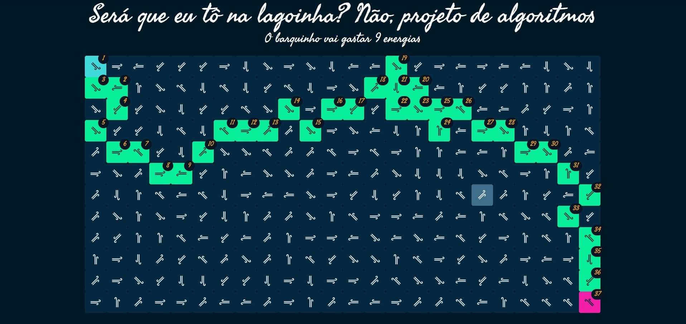
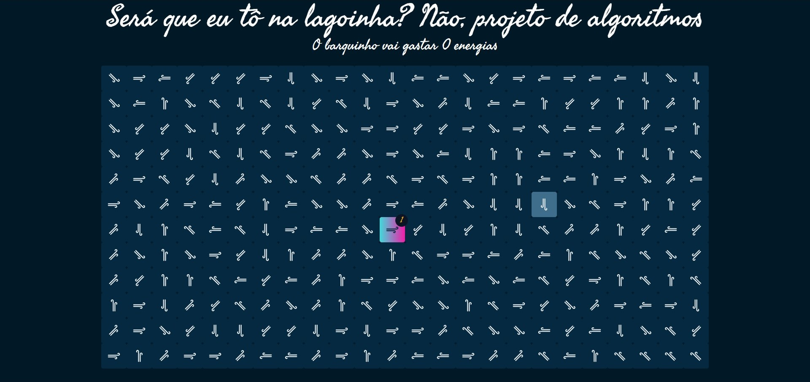

# Será que eu tô na lagoinha? Não, projeto de algoritmos

**Número da Lista**: 20

**Conteúdo da Disciplina**: Final

## Alunos

| Matrícula  | Aluno                           |
| ---------- | ------------------------------- |
| 18/0054848 | Rhuan Carlos Pereira de Queiroz |
| 18/0028308 | Thiago Guilherme Muniz Ferreira |

## Sobre

Baseado no problema [11573](https://onlinejudge.org/index.php?option=onlinejudge&page=show_problem&problem=2620) do Online Judge.

Consiste numa simulação de um lago, em que cada posição do tabuleiro representa um espaço no lago, e nesse espaço existe uma correnteza em uma das 8 direções cardeais.

Existe um barquinho que vai sair do ponto de início (posição em azul) e vai atravessar o lago até a posição de destino (posição em rosa). O barquinho tem duas opções, utilizar a correnteza para ir para a direção sem gastar energia, ou gastar 1 de energia para ir para qualquer direção.

A ideia é que ao clicar em duas posições do tabuleiro, o algoritmo deve retornar o caminho com menor custo energético do começo ao fim.

## Screenshots

## Instalação

**Linguagem**: Javascript

**Framework**: React.js

Instale as dependências do projeto usando o npm ou yarn:
`npm install` ou `yarn`

Inicie o servidor local:
`npm start` ou `yarn start`

## Uso

Abra navegador em `localhost:3000`

## Vídeo

O vídeo se encontra [aqui](https://drive.google.com/file/d/1qrCQ6t7DpKTRMgjcLrxNBN5oia7kz-8u/view?usp=sharing)
